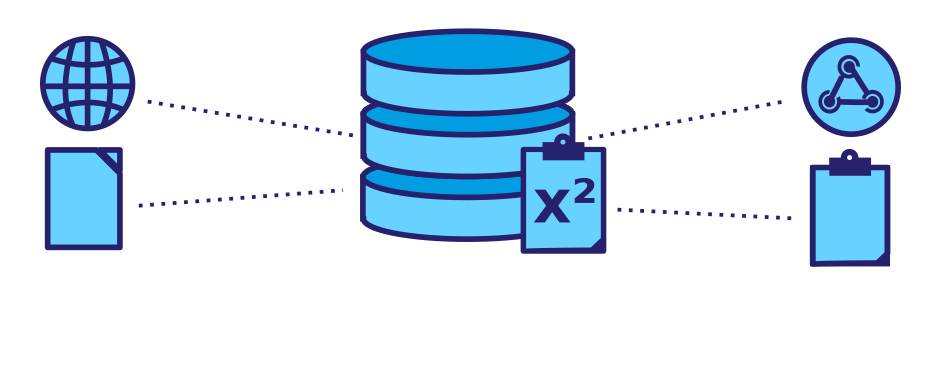

# Extensible Clipboard
This is the improved repository of Extensible Clipboard, 
which has been initially developed by Matthias Rösl. 

Extensible Clipboard is a web-transparent extension of the
traditional system clipboard, enabling users enhanced functionality 
and the capability to create own applications, tapping into 
the functionality of the system clipboard.

🚨 Running extensible clipboard is currently [not supported on OS X platforms](https://stackoverflow.com/questions/57844285/qapplication-clipboard-datachanged-not-work-in-background) due to 
restrictions of the PyQT framework. 

## Features
- 🌏  Remotely set the clipboard on multiple systems via HTTP-Requests

- ⏳ Access the clipboard history via HTTP-Requests

- 📋 Full portation of clipboard functionality to REST-interface ([Read the doc here...](./../../wiki/API-Documentation)
)

- 🔒 Control access to your clipboard by whitelisting clients

## Installation
Installation requires python3.7+, as well as pip on your system. Installation on Linux also requires ```make``` to be installed.

### ... on Linux
Execute ```make``` in project root.

### ... on Windows
Execute ```win_install.bat``` in project root.

## Running 

### ... on Linux
Execute ```make run``` in project root.

### ... on Windows
Execute ```win_run.bat``` in project root.
It's easy as that!

## Configuring 


### Server Whitelist
The clip/backend server will only accept requests from trusted clipboards. Trusted clipboards
can be defined in ExtensibleClipboard/clip_server/config/trusted-clients-config.json: Simply add the
IPv4 address of your clipboard device to the list to allow access to the clipboard.

